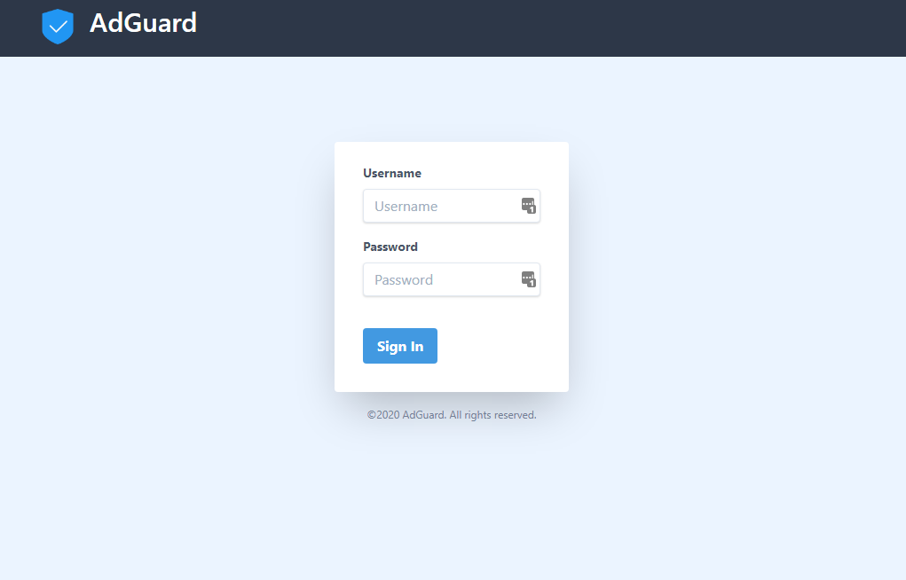
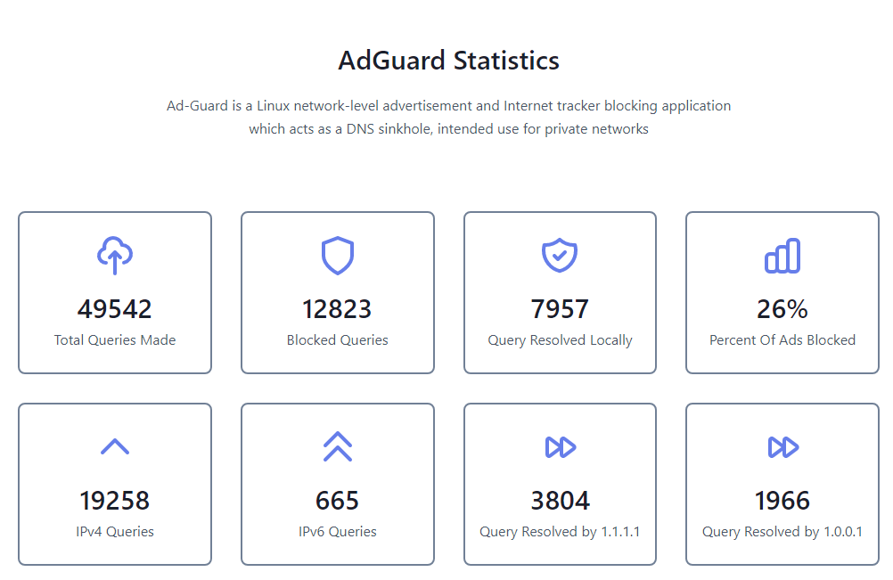
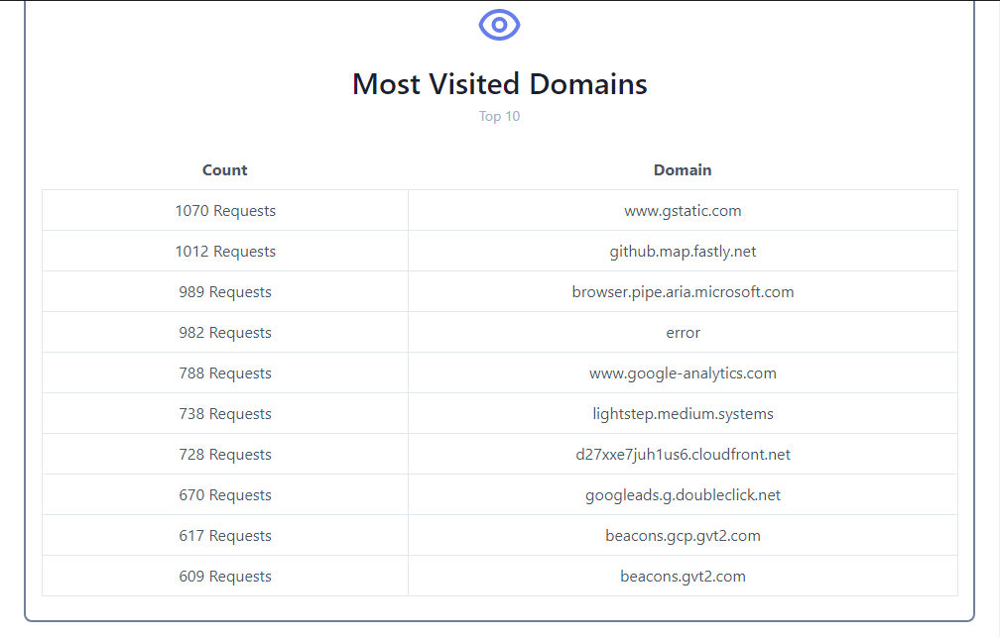
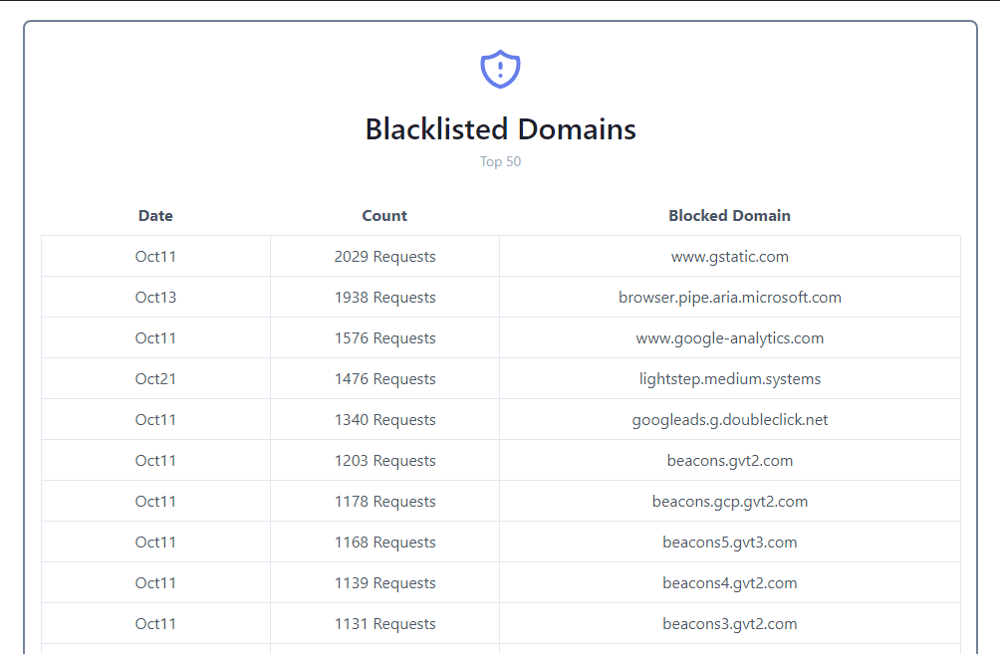

# AdGuard
AdGuard is dnsmasq based adblocker with a Web UI to monitor stats. Get rid of annoying ads protect your devices from pesky malware. Make your web surfing fast, secure and ad-free.Intended use with Raspberry PI.

# Installation
First, clone the repository on to your Raspberry Pi  
``` git clone https://github.com/root-Akshay/AdGuard.git ```  

If, git is not installed,       
```sudo apt install git```    

After the cloning completes,    
Open the AdGuard Directory:  
``` cd AdGuard ```  

Convert the install file to an executable file:\
``` sudo chmod +x install.sh ```  

Run the file, it will install Adguard and other Required Dependencies.  
``` ./install.sh ```  

System will reboot after installation completes  

# Running AdGuard  
To start AdGuard:  
``` sudo systemctl start adguard ```  

To stop AdGuard:  
``` sudo systemctl stop adguard ```  

# Web Interface  
The install.sh script gives your RPI a static IP 192.168.0.200.  

To access the web Panel. Open chrome and type address in search bar.  
``` 192.168.0.200:5000/login ```  

Enter the Id and Password::  
```
Id: Adguard
Pass::Adguard123
```
# Features
* Easy To Install 
* Lightweight 
* Web Panel 
* Responsive 
* Free 


# Screenshots
   

# Resources Used   
* [Hero Icons](https://heroicons.com/) 
* [Steven Black](https://github.com/StevenBlack/hosts)

